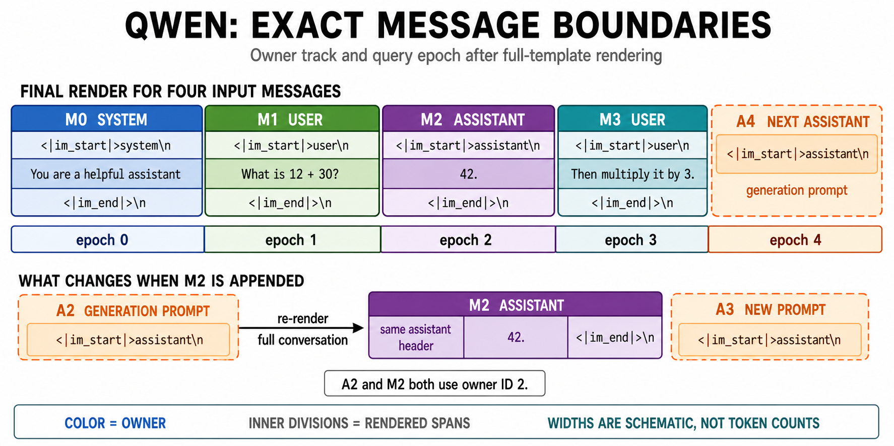

# Drop Message Context System

Mini-SGLang can remove selected earlier chat messages from later attention while
preserving the original token timeline and reusable KV cache. This operation is
called **Drop**.

## Messages and token ownership

Public message IDs are the zero-based indices of the submitted `messages` array.
Internal normalization, including an injected tool description, does not change
these public IDs.

Messages are not tokenized independently. The model's chat template renders the
whole conversation, so delimiters, role headers, generation prompts, and even
earlier text may change when a new message is appended. Mini-SGLang therefore
builds two tracks over the final token stream:

- **Owner:** the public message, or synthetic next-assistant prompt, that owns each
  rendered token. Drop removes message-owned tokens by owner ID.
- **Query epoch:** the prefix-construction step at which each token enters the
  conversation. Message `M_i` uses epoch `i`; the final generation prompt uses
  epoch `N = len(messages)`. A Drop event uses this track to determine its exact
  activation position.

The general partitioning flow is:

1. Keep the submitted messages in order and preserve their public IDs through
   request normalization.
2. For each message index `i`, render the complete prefix `messages[:i+1]` with
   the selected chat template and without a generation prompt. Never tokenize
   messages independently and concatenate the results.
3. Compare each prefix render with the previous one by exact token ID. The longest
   common prefix identifies the part whose history is unchanged; a non-overlapping
   longest common suffix is also recorded for conservative owner attribution.
4. Render the complete message list again with the generation prompt. This is the
   canonical full token stream, and the prompt uses the synthetic next-assistant
   ID `N`, where `N = len(messages)`.
5. Derive final message ownership from the canonical render when exact rendered
   provenance is available, tokenize that render once, and project the rendered
   ownership spans onto token offsets.

### Detailed boundary rules

The owner track and query-epoch track answer different questions and are built
with different rules:

- **Provisional owner track during prefix comparison:** exact stable prefix and
  suffix tokens retain their previous owners. Tokens in the rewritten middle are
  assigned to the newly appended message. This is a conservative fallback for a
  template that rewrites earlier output.
- **Query-epoch track:** only the exact stable prefix retains its earlier epoch.
  Every token from the first changed position onward receives the new message
  epoch, including a suffix whose token values happen to match again. This keeps
  the epoch sequence monotonic.
- **Canonical owner track:** rendered output traced to a message object uses that
  message's public ID. Static text before the first traceable message belongs to
  `M0`; unowned template text after that follows the preceding owner. The final
  generation prompt belongs to synthetic owner `A_N`.
- **Character-to-token projection:** the canonical render is tokenized once with
  character offsets. If one token crosses an ownership boundary, its first
  character decides the owner. A zero-width token inherits the previous token's
  owner.
- **Drop ranges:** consecutive tokens with the same owner form a half-open
  `[start, end)` range. One message may own several non-contiguous ranges. Dropping
  that message removes every one of those ranges.

Only text emitted by the chat template enters either track. An omitted JSON field
or an empty message that renders nothing owns no tokens. Ownership is based on
rendered provenance rather than content matching, so repeated message text does
not make the boundary ambiguous.

### Qwen example

Qwen's
[ChatML-style template](https://huggingface.co/Qwen/Qwen-tokenizer/blob/main/tokenizer_config.json)
emits this block for each message:

```text
<|im_start|>{role}\n{content}<|im_end|>\n
```

With a generation prompt enabled, it then appends:

```text
<|im_start|>assistant\n
```

Consider this request:

```json
{
  "messages": [
    {"role": "system", "content": "You are a helpful assistant"},
    {"role": "user", "content": "What is 12 + 30?"},
    {"role": "assistant", "content": "42."},
    {"role": "user", "content": "Then multiply it by 3."}
  ]
}
```

Using `\n` below to display each actual newline, the canonical render is divided
as follows:

```text
owner  epoch  rendered span
M0     0      <|im_start|>system\nYou are a helpful assistant<|im_end|>\n
M1     1      <|im_start|>user\nWhat is 12 + 30?<|im_end|>\n
M2     2      <|im_start|>assistant\n42.<|im_end|>\n
M3     3      <|im_start|>user\nThen multiply it by 3.<|im_end|>\n
A4     4      <|im_start|>assistant\n
```

Each `M0`-`M3` range includes its role header, exact content, end marker, and
trailing newline. `A4` contains only the final generation prompt and is not a
submitted message.



The append effect is easiest to see one step earlier. With only `M0` and `M1`, the
render ends with generation prompt `A2`:

```text
A2  <|im_start|>assistant\n
```

When the assistant reply is appended as public message `M2`, the complete
conversation is rendered again. The same visible assistant header is now the
start of `M2`, followed by `42.<|im_end|>\n`, and a new `A3` generation prompt is
added. `A2` and `M2` both use numeric owner ID `2` by design. Appending `M3` then
produces the final `A4` prompt shown above.

This is why a new message cannot be represented by independently tokenizing only
its content and appending those tokens. The template may extend or rewrite its
previous suffix, so Mini-SGLang re-renders the conversation and recomputes the
boundary tracks from the resulting full stream.

## 三种 Drop Rule

公开接口统一使用 `drop_rule.type` 判别规则。三个公开 Python 类分别是
`MessageDropRule`、`TextDropRule` 和 `ThinkingDropRule`。旧顶层 `drop_message`
仍可兼容输入，并在入口转换成 `MessageDropRule`；同一请求同时给出新旧接口会返回
HTTP 400。

### MessageDropRule：按完整 message 删除

接口名是 `message_drop`，字段仍叫 `drop_messages`，不使用 `schedule`：

```json
"drop_rule": {
  "type": "message_drop",
  "drop_messages": {"3": [1, 2]}
}
```

事件 `n` 在 message `n` 完成后生效；目标 epoch `t` 的已删除集合是所有 `n < t`
事件的并集。每个 message ID 对应完整模板 provenance owner，因此 role header、content、
结束符和属于该 message 的模板分隔符一起删除。事件和 ID 必须是非负 signed-int64，事件
不能引用未来 message；尚未发生的未来事件可以保留在请求中。

### TextDropRule：按原始 content 子串删除

接口名是 `text_drop`。`drop_messages` 必须与 `messages` 等长、同序且逐项 role 相同；
用户不提供 message ID。某项不删除时，`content` 可写 `null`、`""`、`[]` 或
`[""]`：

```json
"drop_rule": {
  "type": "text_drop",
  "drop_messages": [
    {"role": "system", "content": null},
    {"role": "user", "content": "temporary code"},
    {"role": "assistant", "content": ["Noted", "briefly"]},
    {"role": "user", "content": ""}
  ]
}
```

`content` 可为 `str` 或 `list[str]`，从而在一条 message 内选择不连续片段。每个非空
selector 必须是对应原始 `messages[i].content` 的大小写敏感精确子串，不做 Unicode
normalization；否则返回 HTTP 400。匹配使用 UTF-8 Aho-Corasick O(n) AOT CPU kernel，
同时保留等价 Python reference/fallback 和输入、pattern、输出数量上限。

重复子串默认选择从左到右第 1 次、允许重叠。用户也可提供 `occurrence`：单个字符串配
正整数，字符串列表必须配等长 `list[int]`，不能只给部分 selector 编号。例如：

```json
{"role": "user", "content": ["aba", "answer"], "occurrence": [2, 1]}
```

原始字符区间先映射到完整 chat-template render 中该 message 的唯一 content span，再通过
fast tokenizer 的 canonical `offset_mapping` 映射到绝对 token 区间。只有完全包含在字符
区间内的 token 才删除；横跨边界的 token 保留。如果 selector 没有覆盖任何完整 token，
请求失败而不是扩大删除范围。若一条 message 的 selector 并集恰好覆盖完整原始 content，
系统提升为完整 owner ranges，使它与相同 message ID 的 `MessageDropRule` 精确等价。该规则
固定在最新 user Prefill 完成后生效。

### ThinkingDropRule：保留文本、删除 thinking KV

接口名是 `thinking_drop`：

```json
"drop_rule": {"type": "thinking_drop"}
```

未开启时完全沿用模型 tokenizer/chat template，不做能力探测、模板覆盖或 thinking 解析。
开启后，thinking 必须来自 assistant 的 `reasoning_content`，或 content 中唯一、完整、非嵌套
且位于开头的 `<think>...</think>`。两种来源不得同时提供；双来源、标签残缺或有歧义时均
返回 HTTP 400，系统不会从普通 prose 猜测 thinking。

系统仅在该规则开启时做惰性 retention probe，并按 tokenizer 身份、模板 SHA、tools variant
缓存结果。原生保留历史 thinking 的模板不修改；已识别的 Qwen 历史过滤 guard 使用请求级
Jinja adapter，私有 `preserve_thinking_history` 只对当前请求生效，且必须通过“实际 reasoning
出现一次、无 reasoning 输出不变”的后置校验。未知的过滤模板 fail closed，返回
`thinking_history_not_preservable`。GPT-OSS 仅在该规则开启时用
`RenderConversationConfig(auto_drop_analysis=False)` 保留原生 Harmony `analysis` component，
逐 component 校验 token cursor，只删除 analysis 内容 token；channel/recipient/protocol
token 保留。规则未开启时仍沿用 Harmony 默认的 `auto_drop_analysis` 行为。

每段 thinking 的 Drop event 位于对应 assistant message 末尾。因此 assistant final token 可见
同轮 thinking，后续 user/tool/assistant-generation 不可见。冷缓存 `mask` warmup 仍输入完整
token timeline，以 `full_token_visible_until` 保证先计算 thinking/final，再在事件处删除其
active KV。

### Token and cache behavior

Each newly effective event is compiled to sorted, merged, half-open absolute token
ranges. The surviving tokens keep their original absolute positions; they are not
renumbered after gaps are removed.

The `delta-marker` Radix mode inserts one virtual negative marker at each event
boundary. The marker identifies the event's newly dropped position ranges but owns
no KV page. Consequently, identical token text with different Drop histories
branches to different Radix paths. Cache matching first follows the full token and
marker path, then filters matched KV entries to the positions active for the
request.

Drop changes later visibility. It does not retroactively recompute surviving KV
states from epochs at or before the event, or expand the model's maximum absolute
context length. Later message tokens are prefilled under the new visibility.

## Starting the server

A Drop-enabled configuration with an explicit FlashInfer backend is:

```bash
python -m minisgl \
  --model Qwen/Qwen3-0.6B \
  --cache-type radix \
  --page-size 1 \
  --radix-drop-key-mode delta-marker \
  --contextual-prefill-mode mask \
  --attn fi \
  --port 1919
```

Relevant options:

| Option | Values and behavior |
| --- | --- |
| `--radix-drop-key-mode` | `delta-marker` is the default and the only mode that accepts a non-empty Drop Rule. `bitmask` and `symbol` are legacy no-Drop modes. |
| `--page-size` | Must be `1` with `delta-marker`. TRTLLM attention is incompatible because it requires non-unit pages. |
| `--contextual-prefill-mode` | `mask` (default) or `staged`. The old `flashinfer-mask` and `flashattention-mask` names are deprecated CLI aliases for `mask`. |
| `--attn` / `--attention-backend` | In `mask` mode, the selected Prefill backend compiles its native exact representation. FlashInfer and FlashAttention are supported; unsupported backends fail during startup. |
| `--cache-type` | Use `radix` to reuse full token and Drop-history prefixes. |
| `--request-timeout` | Seconds without a reply before timeout; default `300`, or `0` to disable. |

`mask` sends one full-token-timeline warmup carrying the backend-neutral
`full_token_visible_until` metadata. FlashInfer compiles it into exact active-KV
segments. FlashAttention uses the FA3 segmented adapter on SM80/SM90 or the FA4
`mask_mod` adapter on SM100/SM110. The Scheduler validates the actual Prefill
backend instead of requiring the frontend mode to name that backend.

`staged` remains available for compatibility and diagnosis. It first measures the
internal active-prefix cache reuse. A `cache_reuse_ratio` greater than or equal to
`0.95` ends warmup; only a strictly lower ratio triggers per-message prefix
warmups. This internal value is separate from the user-visible `cache_hit_ratio`.

Known limitations remain backend-specific. Context-mask Prefill requires
`page_size=1`. FA4 mask Prefill is restricted to one request per batch, and its
GPT-OSS sinks/sliding-window combination is not enabled. A backend or GPU build
without the required adapter is rejected instead of silently running ordinary
causal attention.

For tied embeddings, a checkpoint may legally contain both
`model.embed_tokens.weight` and a redundant `lm_head.weight`. The loader preserves
template-specific dtypes for known model tensors (including GPT-OSS packed
`uint8`), while passing template-external keys to the strict model loader. The
tied LM head consumes its redundant alias; unrelated unknown keys remain errors.

## Chat API

Drop is exposed through the OpenAI-style endpoint:

```text
POST /v1/chat/completions
```

Minimal request:

```bash
curl http://127.0.0.1:1919/v1/chat/completions \
  -H 'Content-Type: application/json' \
  -d '{
    "model": "Qwen/Qwen3-0.6B",
    "messages": [
      {"role": "system", "content": "Answer briefly."},
      {"role": "user", "content": "My temporary code is 4815."},
      {"role": "assistant", "content": "Noted."},
      {"role": "user", "content": "Continue without using the temporary code."}
    ],
    "drop_rule": {
      "type": "message_drop",
      "drop_messages": {"2": [1]}
    },
    "max_tokens": 64,
    "stream": false
  }'
```

The `messages` entries support these roles and fields:

```text
role: system | user | assistant | tool | function
content: string | null
reasoning_content: string | null
name: string | null
tool_call_id: string | null
tool_calls: array | null
```

The backend applies `max_tokens`, `temperature`, `top_k`, `top_p`, `ignore_eos`,
`stop`, and `stream`. The chat path also supports `enable_thinking`,
`reasoning_effort`, `tools`, and `tool_choice`. The schema currently accepts `n`,
`presence_penalty`, and `frequency_penalty`, but does not apply them to backend
sampling. `message_drop.drop_messages` 的 JSON object key 在 wire 上是字符串，并解析为
整数事件 ID。

Drop Rule 只支持 chat `messages`，不支持 plain `prompt`。结构、子串、occurrence、thinking
来源或模板能力校验失败均返回 HTTP 400。非流式成功响应在顶层返回
`cache_hit_ratio`；流式响应只在最后一个带 `finish_reason` 的 SSE chunk 顶层返回该字段。
它是最终用户生成请求的 `cached_active_len / full_matchable_prefix_len`：分子是命中的未
Drop token，分母是 Drop 前全部可参与 Radix 匹配的真实 token，不包含最后一个强制 Prefill
token 和 virtual marker；空分母为 1.0。内部 warmup 使用
`cached_active_len / active_matchable_prefix_len`，不会暴露为用户结果。

## Implementation map

| Concern | Source |
| --- | --- |
| Public schema and validation | [`drop_rules.py`](../../python/minisgl/tokenizer/drop_rules.py#L60), [`api_server.py`](../../python/minisgl/server/api_server.py#L161) |
| Template-independent epochs and token ownership | [`tokenize.py`](../../python/minisgl/tokenizer/tokenize.py#L934), [`template_provenance.py`](../../python/minisgl/tokenizer/template_provenance.py#L206) |
| Text matcher | [`text_match.py`](../../python/minisgl/kernel/text_match.py#L127), [`text_match.cpp`](../../python/minisgl/kernel/csrc/src/text_match.cpp#L37) |
| Thinking retention adapter | [`thinking_template.py`](../../python/minisgl/tokenizer/thinking_template.py#L86), [`tokenize.py`](../../python/minisgl/tokenizer/tokenize.py#L273) |
| Position-range Drop compilation | [`tokenize.py`](../../python/minisgl/tokenizer/tokenize.py#L700), [`tokenize.py`](../../python/minisgl/tokenizer/tokenize.py#L1045) |
| Virtual delta markers | [`radix_delta.py`](../../python/minisgl/scheduler/radix_delta.py#L12-L261) |
| Full-path cache match and active-KV filtering | [`cache.py`](../../python/minisgl/scheduler/cache.py#L121-L200) |
| Startup and backend constraints | [`args.py`](../../python/minisgl/server/args.py#L176-L265), [`scheduler.py`](../../python/minisgl/scheduler/scheduler.py#L55-L131) |
| Contextual warmup | [`api_server.py`](../../python/minisgl/server/api_server.py#L755), [`prefill.py`](../../python/minisgl/scheduler/prefill.py#L67) |
| Cache-hit ratio response propagation | [`scheduler.py`](../../python/minisgl/scheduler/scheduler.py#L255), [`tokenizer/server.py`](../../python/minisgl/tokenizer/server.py#L121), [`api_server.py`](../../python/minisgl/server/api_server.py#L953) |
| Tied-weight checkpoint loading | [`engine.py`](../../python/minisgl/engine/engine.py#L159-L177), [`embedding.py`](../../python/minisgl/layers/embedding.py#L59-L85), [`base.py`](../../python/minisgl/layers/base.py#L32-L53) |
