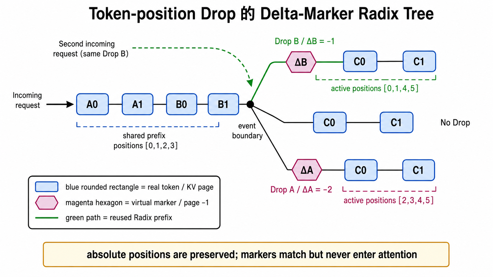

# 修改报告 1（2026-07-30）

## 带特殊节点的 Radix Tree

2026-07-30 的实现把 Drop 集合编码成 **虚拟 delta marker**，使“token 文本相同、Drop 历史不同”的请求不会误命中同一条 Radix 分支。以 message 为粒度时，流程是：先将被丢弃的 message ID 排序、去重并压缩为半开区间；再由注册表把相同区间集合稳定映射为同一个负数 marker；最后在对应事件边界把 marker 插入 Radix key。marker 的 `virtual_mask=True`、page value 固定为 `-1`，因此参与前缀匹配与分叉，却不占用 KV page。节点拆分、插入、淘汰和完整性检查同时携带 `virtual_mask`，Radix 边的身份由“key 值 + 是否虚拟”共同确定。

这样，相同消息与相同 Drop 历史会复用同一 marker 分支；Drop 历史不同则在事件边界分叉。命中后只把真实 token 对应的 page index 交给模型，虚拟 marker 被过滤，不会进入 attention。历史实现见提交 `c358943` 中 `canonicalize_delta`（`scheduler/radix_delta.py:11`）、`DeltaMarkerRegistry`（`:56`）、`inject_delta_markers`（`:104`），以及 `RadixCache._edge_key`（`kvcache/radix_cache.py:17`）和 `TreeNode.page_length`（`:64`）。当前版本进一步把 delta 从 message ID 区间升级为绝对 token-position 区间，原理保持不变，示意见下图。

## Qwen3 assistant 正文漂移修复

问题根因不是正文内容本身，而是 token 归属推断。Qwen3 的 chat template 可能在重新渲染时删除 assistant 的 thinking 段，并重写历史尾部；旧的逐轮追加/LCP 差分会把这段“被重写后才出现的正文或模板后缀”误归给下一条 message，导致 Drop 时正文随下一条消息一起被删除或保留。

修复方法是对 Jinja chat template 做无语义改变的 provenance 插桩：在 message 循环的输出边界临时加入 owner 标记，完整渲染后移除标记并得到逐字符 message owner；随后使用 fast tokenizer 的 `offset_mapping` 把字符归属映射为 token 归属，并强制校验 token IDs 与原始 `apply_chat_template` 的规范输出完全一致。它依据实际 message 对象和模板控制流确定归属，不再依赖文本子串、LCP 或“每条消息单独 tokenize”。实现入口见 [`build_template_token_provenance`](../../python/minisgl/tokenizer/template_provenance.py#L203)，Drop 路径接入见 [`tokenize.py`](../../python/minisgl/tokenizer/tokenize.py#L924)；Qwen3 回归覆盖见 [`test_token_position_drop_e2e.py`](../../tests/context/test_token_position_drop_e2e.py#L58)。历史修复提交为 `bf7b84b`。
